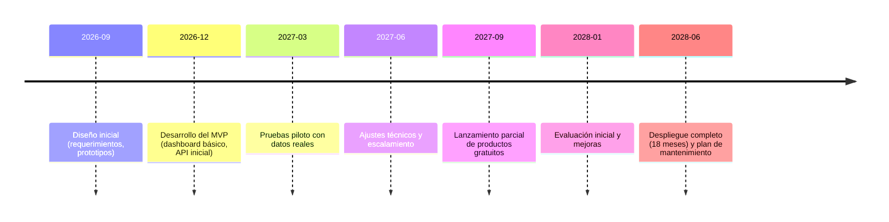

# Resumen Ejecutivo

Este informe mapea las **decisiones clave** y las **necesidades de información** de gobiernos regionales, municipalidades, empresas y ciudadanía en Perú, organizadas por los dominios de territorio, población, presupuesto, inversión pública, servicios, salud, educación, seguridad ciudadana, empleo, riesgos y actividad económica. Se identifica qué **preguntas concretas** se plantean cada año (por ejemplo, habitantes de un distrito, brechas de infraestructura, cobertura de servicios, índices de criminalidad, desempleo regional, riesgos naturales, etc.), qué **variables** requieren, qué **instituciones** las producen y cuáles son las bases de datos oficiales y APIs disponibles (con su cobertura territorial, periodicidad y nivel de detalle), así como las **limitaciones metodológicas** y riesgos asociados (privacidad, calidad de datos, omisiones, etc.).

Con base en este diagnóstico, se proponen **productos digitales gratuitos** (dashboards, mapas, observatorios, boletines, visualizaciones interactivas, APIs derivadas, etc.) y **servicios comerciales** (análisis de datos territoriales, modelado predictivo, monitoreo de indicadores, consultorías, suscripciones especializadas, etc.). Cada producto o servicio se compara en términos de utilidad social, diferenciación, factibilidad técnica, costos de desarrollo/mantenimiento, clientes potenciales y riesgos. Se incluye una **matriz de priorización** considerando demanda, diferenciación, complejidad, coste, escalabilidad y riesgo para determinar cuáles iniciativas son más estratégicas. También se sugiere la **periodicidad de actualización** recomendada de cada producto y se ilustran ejemplos de visualizaciones. Finalmente, se presentan diagramas *mermaid* que muestran las relaciones entre actores (gobiernos, ciudadanía, empresas, periodistas, candidatos), un cronograma de implementación de 6–18 meses y el flujo de datos desde las fuentes oficiales hacia los productos finales.

Los datos consultados provienen de fuentes oficiales peruanas y destacan la existencia de infraestructuras de datos como el **IDEP** (Infraestructura Nacional de Datos Espaciales) para geodatos, la **Plataforma Nacional de Datos Abiertos** (gob.pe/datosabiertos) que concentra cientos de datasets gubernamentales, los sistemas del **INEI** (censos, encuestas ENAHO, ENE-H, ENEI, etc.), de ministerios como **MEF** (gasto público, Inversión Pública con Invierte.pe, SIAF), **MINSA** (REUNIS, SINADEF), **MINEDU** (estadísticas educativas), **MININTER/PNP** (seguridad ciudadana; por ejemplo, INEI desarrolló un sistema integrado que permite visualizar datos criminales georreferenciados) y otros organismos reguladores (OSCE, SUNASS, OSINERGMIN, OSIPTEL, SENAMHI, CENEPRED, etc.). Con base en este inventario se construyen los productos y servicios propuestos, sin invención de datos adicionales (se indica dónde la información no está disponible o requeriría validación adicional).

## 1. Fuentes oficiales principales

- **INEI (Instituto Nacional de Estadística e Informática)**: Censos de población (últimos en 2017 y 2025), encuestas socioeconómicas (ENAHO – empleo, consumo; ENDES – demografía y salud; ENEI – empleo; entre otras), estadísticas sectoriales (educación, salud, seguridad, victimización). Banco de datos en REDATAM por distrito, con tablas y mapas. Publica informes anuales. Cobertura: nacional, regional, provincial y distrital (en los censos); actualización: censos ~10 años, encuestas anuales o trimestrales. Limitaciones: subregistro en encuestas, omisión de población en censos (5% en 2017).
- **RENIEC (Registro Nacional de Identificación y Estado Civil)**: Registro de nacimientos, defunciones y estadísticas vitales. Útil para población real y tasas de natalidad/mortalidad al nivel distrital. Normalmente publica agregados anuales; datos individuales confidenciales. Riesgo: privacidad y calidad de registro (defunciones rurales tardías).
- **MEF (Ministerio de Economía y Finanzas)**: Gestiona el SIAF (Sistema Integrado de Administración Financiera) con datos de presupuesto y ejecución a nivel nacional, regional y local. Portal “Transparencia Económica” consulta gastos por entidad, programa, fuente de financiamiento. También administra **Invierte.pe** (Sistema de Inversión Pública) para seguimiento de proyectos con código único. MEF publica balances generales y resultados macroeconómicos (indicadores PIB, empleo, etc.). Cobertura: nacional y subnacional; frecuencia: gastos mensuales; calidad: puede haber rezagos contables.
- **PCM / CEPLAN**: Planificación estratégica y planes de desarrollo regional/provincial/distrital. Documentos de línea base y brechas por sector. Menos bases de datos abiertos, más informes coyunturales.
- **MINSA (Ministerio de Salud)**: REUNIS (Repositorio de Información en Salud) reúne estadísticas de mortalidad (via SINADEF), morbilidad, recursos de salud, programas sociales. Cobertura nacional/regional; periodicidad: SINADEF diario; indicadores de salud principales anuales. Limitaciones: subregistro de causas, calidad de diagnóstico.
- **MINEDU (Ministerio de Educación)**: Estadísticas de infraestructura escolar, matrículas, docentes, resultados de evaluaciones (evaluaciones censales anuales). Sistema de Información de la Gestión Educativa (SIGED). Cobertura nacional/regional; actualización anual. Riesgos: datos desagregados limitados por privacidad de alumnos.
- **MININTER / PNP**: Estadísticas de seguridad ciudadana. INEI cuenta con un Sistema Integrado de Estadísticas de Criminalidad (en colaboración con Poder Judicial, Ministerio Público, etc.) que permite georreferenciar delitos por manzana. PNP/Mininter publica cuadros nacionales y por departamento de denuncias y casos atendidos. Cobertura: nacional y departamental; actualización anual o trimestral. Limitaciones: alto subregistro de delitos.
- **MINTRA (Ministerio de Trabajo)**: Indicadores de empleo, planilla electrónica (número de trabajadores formales registrados por sector y región). Complementa encuestas INEI. Cobertura: datos formales registrados.
- **MINAGRI / PRODUCE / MINEM**: Estadísticas sectoriales (producción agrícola, pesquera, minera, energía, hidrocarburos). Publican informes anuales; datos de producción por región. Cobertura: nacional y regional; periodicidad anual.
- **BCRP (Banco Central de Reserva)**: PIB nacional y por departamento (estados financieros regionales), inflación regional, inversión extranjera, etc. Publica datos macro regulares (mensual/trimestral).
- **SUNAT**: Registro Nacional de Contribuyentes (RUC): número de empresas/establecimientos por actividad económica y ubicación. Puede usarse para aproximar densidad económica por distrito. Publica reportes agregados; se expone vía portal de estadísticas.
- **OSCE / SEACE**: Portales de contrataciones públicas. OSCE (registros de procesos de selección y contratos estatales); SEACE (información de contrataciones). Útiles para monitorear inversión pública contratada. Cobertura: todas las entidades estatales; actualización diaria de procesos; datos abiertos limitados (CKAN OSCE con datasets). Riesgos: duplicidades, datos técnicos no estandarizados.
- **SIAF / SIGA**: Portal del MEF con consulta amigable a ejecución presupuestal. Publica información por programas y categorías.
- **SUNASS**: Regula servicios de saneamiento. Datos de cobertura de agua potable y alcantarillado urbano/rural por EPS (empresas prestadoras) y región. Actualización anual.
- **OSINERGMIN**: Regulador de energía y minería. Reportes de cobertura eléctrica, producción de energía por región, accidentes mineros. Cobertura nacional/regional; publicación anual o trimestral.
- **OSIPTEL**: Regulador de telecomunicaciones. Indicadores de cobertura de telefonía e internet por provincia. Actualización anual.
- **SENAMHI**: Pronóstico y registro meteorológico. Precipitación, temperatura, sequías, eventos climáticos (El Niño, friajes) por estación. Cobertura nacional (red de estaciones); actualiza diario/hora. Datos disponibles para descarga histórica. Calidad: hay zonas sin estaciones (montaña).
- **CENEPRED / INDECI / IGP**: Información de riesgo de desastres. CENEPRED publica mapas de amenazas (inundaciones, deslizamientos) a nivel distrital/provincial. INDECI reporta históricos de desastres. IGP (Instituto Geofísico) registra sismos y peligros geológicos. Cobertura nacional; mapas de amenazas con periodicidad irregular (cuando se revisan). Limitaciones: mapas a veces de baja resolución espacial.
- **SENAMHI / ANA**: SENAMHI (clima); ANA (Autoridad Nacional del Agua) con datos de caudales e inundaciones. Completa información de riesgos hidrológicos.
- **RENIEC (Nacimientos, Defunciones)**: Aunque vinculada a MINSA, RENIEC genera estadísticas vitales (diferenciadas por distrito). Buen complemento al SINADEF.
- **ONPE / JNE**: Resultados electorales históricos por mesa y distrito (Intranet pública JNE). Sirve para análisis político, encuestas de opinión. No es base de gestión diaria, pero relevante en ciclo electoral.
- **ONP (Pensiones)**, **SISFOH / MIDIS**: Bases de focalización social, pobreza y subsidios. SISFOH (MEF) y MIDIS manejan datos de pobreza (FOCAS, SIT) y beneficiarios de programas sociales (Juntos, Pensión 65). Accessibles como reportes agregados.
- **Municipalidades y Gobiernos Regionales**: Muchas publican datos abiertos locales en plataformas regionales (e.g., Lima Metropolitana, Cusco, Arequipa, etc.). Varía mucho la calidad y apertura; usualmente se encuentran catastros, inventarios de obras, planes de desarrollo, ordenanzas. Frecuencia: anual o por gestión municipal. No existe un catálogo unificado nacional, pero el portal *datos.gob.pe* incluye enlaces a portales locales.

En resumen, las fuentes primarias peruanas son abundantes pero dispersas. El reto está en integrarlas para tomar decisiones locales. A continuación se describen las **necesidades de información** por cada dominio temático y actor.

## 2. Necesidades informativas por dominio

### 2.1 Territorio
- **Decisiones clave:** Definir jurisdicciones y límites territoriales; zonificación urbana y rural; planificación urbana/rural; ubicación de infraestructura (vivienda, carreteras); gestión de catastro y propiedad; monitoreo ambiental (bosques, mineras).
- **Actores / Preguntas:**
  - *Gobiernos (regionales y municipales):* “¿Cuáles son los límites exactos de mi distrito/provincia? ¿Cómo ha cambiado la extensión por reasignaciones o creación de nuevos distritos?”
  - *Ciudadanos:* “¿A qué jurisdicción pertenezco? ¿Dónde está el catastro catastral de mi predio?”
  - *Empresas:* “¿Dónde ubicar una planta o tienda considerando la topografía y accesibilidad?”
  - *ONG/Jornalistas:* “¿Cómo se solapan zonas de riesgo (inundaciones/deslizamientos) con centros poblados?”.
- **Variables necesarias:** Coordenadas geográficas (polígonos de regiones, provincias, distritos), mapas catastrales, usos de suelo, redes (carreteras, redes de servicios), altimetría.
- **Fuentes e instituciones:** IDEP/IGN para cartografía base del Perú (mapas topográficos y límites administrativos). SUNARP/Catastro Nacional de Predios (propiedad privada). SERFOR/PNUMA (bosques, áreas protegidas). SBN (tierras fiscales). COFOPRI (titulación de vivienda). Gobierno Regionales y Municipalidades (planes urbanos y catastros locales). Gobierno (Municipalidades) – muchas cuentas con plataformas SIG locales.
- **Bases de datos/APIs:** IDEP ofrece servicios web geográficos (WMS/WFS) y catálogo de metadatos. Varios gobiernos locales usan Sistemas de Información Geográfica con APIs internas. No hay una API única nacional para límites (excepto el portal IDEP).
- **Cobertura/Desagregación:** Nacional, con detalle hasta distrito; posible hasta manzana urbana en catastro municipal.
- **Periodicidad:** Actualización tras cambios administrativos (creación de distritos, ajuste de fronteras) – infrecuente. Mapas de riesgos se actualizan ocasionalmente (cada pocos años).
- **Calidad/Límites:** Puede haber inconsistencias entre fuentes (p.ej. catastro local vs registros nacionales). Escasez de datos en áreas rurales remotas. Limitación en detalles si sólo hay shapefiles sin atributos completos.
- **Riesgos legales/éticos:** El catastro incluye datos de propietarios (no abiertos), solo se comparte geolocalización de parcelas. Errores en georreferenciación pueden afectar planificación.

### 2.2 Población
- **Decisiones clave:** Planificación de servicios públicos (vivienda, salud, educación); distribución de presupuesto según población; cálculos electorales (padrón); focalización de programas sociales; análisis de migración interna.
- **Actores / Preguntas:**
  - *Gestores públicos:* “¿Cuál es la población total y densidad de cada distrito? ¿Cómo ha crecido la población en los últimos años?”
  - *Candidatos/Organizaciones políticas:* “¿Cuántos electores hay por distrito/ciudad? ¿Cuál es la distribución por edad y género de mis potenciales votantes?”
  - *Periodistas:* “¿Qué migración (urbana/rural) ha ocurrido, y cómo afecta a los servicios?”
  - *Empresas:* “¿Cuál es el tamaño del mercado (número de habitantes) en tal localidad?”
- **Variables necesarias:** Población total y por grupo (edad, género), tasa de crecimiento, densidad poblacional, tasa de urbanización, migración neta, hogares y viviendas, indicadores de pobreza.
- **Fuentes e instituciones:** INEI realiza censos nacionales (cada ~10 años) y proyecciones. El *Censo 2025* reportó ~34.16 millones de habitantes. Entre censos, INEI publica estimaciones anuales de población. RENIEC aporta nacimientos y defunciones registradas (estadísticas vitales). Encuestas de INEI (ENAHO) incluyen datos de estructura del hogar y canasta familiar. Registro del padrón electoral (ONPE) da electores por distrito (actualizado previo a cada elección).
- **Bases de datos/APIs:** INEI publica fichas estadísticas y base REDATAM por provincia/distrito (Censos 2007, 2017, 2025). Los resultados de Censos 2017/2025 están en línea (censos.inei.gob.pe). Proyecciones municipales disponibles en libros del INEI. APIs específicas poco usuales; se dispone de tabulados descargables en CSV/Excel.
- **Cobertura/Desagregación:** Datos disponibles hasta nivel distrital (círculo censal) y urbano/rural; población indígena. Padrón electoral permite datos de electores por distrito.
- **Periodicidad:** Censos decenales (2017, 2025); proyecciones anuales; encuestas de hogares anuales; nacimientos/defunciones registradas mensuales.
- **Calidad/Límites:** Los censos recientes tienen omitidos (~4–6% en 2017, 4.25% en 2025); proyecciones basadas en modelos. Registros civiles no captan nacimientos en zonas aisladas. Encuestas INEI miden población de 15+ años (no niños). Riesgo de privacidad (no se liberan microdatos individuales sin anonimizar).

### 2.3 Presupuesto público
- **Decisiones clave:** Asignación de recursos por sector (salud, educación, obras); evaluación de ejecución presupuestal; ajuste de partidas ante necesidades emergentes; transparencia fiscal.
- **Actores / Preguntas:**
  - *Gobiernos (regional, municipal):* “¿Cuál es el monto del presupuesto asignado y cuánto hemos ejecutado al trimestre?”
  - *Organizaciones civiles/Medios:* “¿En qué proyectos y áreas se gasta el dinero público en nuestra región? ¿Hay despilfarro o subejecución?”
  - *Candidatos/Partidos:* “¿Qué políticas públicas han sido priorizadas en el presupuesto y con qué impacto?”
  - *Empresas:* “¿Cuáles son las oportunidades de contratación según presupuesto y licitaciones previstas?”
- **Variables necesarias:** Presupuesto aprobado por entidad, partida económica y funcional; gasto ejecutado real; saldo y desfases; inversiones por proyecto; remuneraciones y plazas presupuestadas.
- **Fuentes e instituciones:** MEF administra el SIAF. El *Portal de Transparencia Económica* (SIGA) permite consultar ejecución presupuestal consolidada por entidad y rango de tiempo. CEPLAN promueve seguimiento a inversiones (por FIDT, fondo de desarrollo territorial). Los gobiernos regionales/municipales reportan sus presupuestos aprobados (DS y ordenanzas regionales).
- **Bases de datos/APIs:** No hay una API pública universal; MEF publica consultas web. Datos abiertos del portal gob.pe incluyen algunos CSV de Ejecución Presupuestal. Los datos financieros de entes (Cuenta General de la República) son auditables.
- **Cobertura/Desagregación:** Nacional y subnacional; desglose hasta unidad ejecutora en SIAF. Frecuencia: mensual (gasto acumulado hasta fecha).
- **Periodicidad:** Cada mes se actualiza la ejecución presupuestal; se liberan datos anuales consolidados post-ejercicio.
- **Calidad/Límites:** Desfase entre compromiso y gasto real; variaciones metodológicas (devengado vs pagado). Cambios en clasificaciones de gasto pueden dificultar comparaciones históricas. Riesgos: uso político de cifras, infrarepresentación de gastos fuera de presupuesto.

### 2.4 Inversión pública
- **Decisiones clave:** Priorización de proyectos de infraestructura (salud, educación, caminos), asignación de financiamiento multianual, monitoreo de avance de obra, evaluación de resultados.
- **Actores / Preguntas:**
  - *Gobiernos:* “¿Qué obras públicas están planificadas o en ejecución en mi región? ¿Cuál es el estado y presupuesto de cada proyecto?”
  - *Medios/Ciudadanos:* “¿Por qué hay obras paralizadas o sobrecostos? ¿Hay proyectos sin licitar?”
  - *Empresas contratistas:* “¿Qué licitaciones está por lanzar cada gobierno, y qué requerimientos tienen?”
  - *Candidatos/Partidos:* “¿Cómo se están cumpliendo las promesas de campaña en obras públicas? ¿Dónde priorizar recursos?”
- **Variables necesarias:** Número de proyectos de inversión (por sector y entidad), ubicación (regional/distrital), monto programado vs ejecutado, cronograma, indicadores de avance físico.
- **Fuentes e instituciones:** **Invierte.pe (MEF)** – plataforma oficial de programación multianual e inversión pública, con consulta de proyectos por código único (PIP). **OSCE/SEACE** – procesos de selección (licitaciones y contrataciones). **GOREs/Municipios** – informes locales de ejecución de proyectos de inversión pública.
- **Bases de datos/APIs:** Invierte.pe ofrece consulta web por proyecto; MEF publica algunos datasets abiertos (programación financiera, proyectos por provincia). OSCE tiene un portal (https://compras.gob.pe) que permite descargar datos de licitaciones. Algunos terceros (ONG, universidades) pueden scrapear Invierte.pe.
- **Cobertura/Desagregación:** Nacional y subnacional; proyectos individuales hasta nivel de distrito.
- **Periodicidad:** Actualización continua (cada nuevo registro/proyecto). Informes formales anuales de inversiones ejecutadas.
- **Calidad/Límites:** Proyectos pueden ser cancelados o reprogramados, dificultando seguimientos. Falta de estandarización en estados de avance. Riesgos: datos incompletos (muchos proyectos informan mal sus etapas), retrasos en publicación. Sin una API oficial, la recolección exige scraping.

### 2.5 Servicios públicos (agua, energía, transporte, etc.)
- **Decisiones clave:** Mejora de la cobertura y calidad de servicios básicos (agua, electricidad, saneamiento, transporte); regulación de tarifas y concesiones; inversión en infraestructura de servicios; monitoreo de prestación.
- **Actores / Preguntas:**
  - *Gobiernos/reguladores:* “¿Qué porcentaje de la población cuenta con acceso a agua potable, alcantarillado, luz eléctrica o internet en cada distrito?”
  - *Ciudadanos:* “¿Cuál es la calidad/continuidad del servicio de agua/luz en mi zona?”
  - *Empresas de servicios:* “¿Dónde expandir redes (agua, energía) para captar más usuarios? ¿Qué tarifas y regulaciones aplican?”
  - *Medios/ONG:* “¿Se cumple la regulación (p.ej. número de cortes de luz vs. programa de mantenimiento reportado)?”
- **Variables necesarias:** Cobertura (%) de red de agua/luz/alcantarillado, número de conexiones, calidad del agua, horas promedio de servicio, tarifas, volumen consumido per cápita, índices de pérdida (agua, energía), cantidad de siniestros.
- **Fuentes e instituciones:** **SUNASS** (regula empresas de agua potable; publica indicadores de cobertura y continuidad por EPS y región). **OSINERGMIN** (regula energía; reporta cobertura eléctrica, acceso a GLP y gas natural). **OSIPTEL** (cobertura de telecom, # de líneas telefónicas e internet, indicadores de competencia). **MTC** (Ministerio de Transportes; estadística de caminos pavimentados, red vial por región, congestión). **SENASA** u otros para saneamiento de alimentos.
- **Bases de datos/APIs:** Reguladores suelen ofrecer reportes descargables (no hay API pública estandarizada). SUNASS tiene observatorio con datos por EPS. OSIPTEL publica informes trimestrales. Datos accesibles en formato PDF/CSV.
- **Cobertura/Desagregación:** Nacional y regional; a nivel provincia/distrito para cobertura de agua y luz (SUNASS).
- **Periodicidad:** Datos de indicadores anuales o trimestrales. Monitoreo en tiempo real limitado (p.ej. calidad del agua sólo en auditorías anuales).
- **Calidad/Límites:** Cobertura declarada puede diferir de la real (pérdidas no registradas). Zonas rurales muy subreportadas. Riesgos: datos de calidad del agua y de cortes de luz se difunden con retraso y dependen de autoevaluación de las empresas.

### 2.6 Salud
- **Decisiones clave:** Localización de centros de salud, dotación de personal médico, campañas de prevención, distribución de vacunas y medicinas, respuesta a brotes epidémicos.
- **Actores / Preguntas:**
  - *Gestores sanitarios (MINSA/ESSALUD):* “¿Cuántos hospitales y postas hay en cada distrito? ¿Cuál es la dotación de personal por paciente atendido?”
  - *Ciudadanos:* “¿Dónde está el centro de salud más cercano? ¿Cómo evoluciona la tasa de mortalidad materna o de niños en mi región?”
  - *Empresas (farmacéuticas, salud privada):* “¿Qué segmentación demográfica existe para servicios de salud (edad, enfermedades crónicas) en un área determinada?”
  - *Medios/ONG:* “¿Cuáles son las brechas en indicadores sanitarios (anemia, vacunación) y cómo varían territorialmente?”
- **Variables necesarias:** Número de camas hospitalarias, médicos y enfermeros por población; centros de salud (GPS); registros de morbilidad (enfermedades prevalentes); mortalidad infantil/materna; cobertura de seguros (SIS, EsSalud). Indicadores de salud pública (tasa de anemia, desnutrición, esperanza de vida).
- **Fuentes e instituciones:** **MINSA** con REUNIS (indicadores demográficos de salud) y SINADEF (defunciones registradas). **RENIEC** colabora con MINSA en nacimientos/defunciones. **EsSalud** (aseguradora social) reporta afiliados y prestaciones. **INEI/ENDES** (Encuesta Nacional Demográfica y de Salud) ofrece datos de salud materno-infantil por región. **SIS** informa sobre cobertura del seguro integral de salud.
- **Bases de datos/APIs:** REUNIS tiene un portal informativo (tablas y gráficos); MINSA publica anualmente “Indicadores básicos de salud”. SINADEF ofrece consulta de defunciones por causa y distrito a través de su web (datos abiertos por año/distrito). No existe API pública, pero datos agregados se pueden descargar (p.ej. bases de mortalidad). INEI ENDES permite tabulación en BDE.
- **Cobertura/Desagregación:** Nacional y regional; indicadores de salud suelen reportarse hasta provincia; defunciones en todos los distritos.
- **Periodicidad:** Datos demográficos/sanitarios cada año (encuestas) o mes en SINADEF. Estadísticas de vacunación y enfermedades (por MINSA) se actualizan quincenal o mensualmente internamente; resumen anual.
- **Calidad/Límites:** Subregistro de causas de muerte en zonas rurales; encuestas no cubren muestras pequeñas muy localizadas. Indicadores de salud (anemia, bajo peso) provienen de muestras de encuesta, con margen de error en áreas pequeñas. Riesgos: datos individuales sensibles (salud).

### 2.7 Educación
- **Decisiones clave:** Construcción y equipamiento de escuelas, asignación de maestros, mejora de calidad educativa, planes de mejora escolar, programas de becas.
- **Actores / Preguntas:**
  - *MINEDU (todas instancias):* “¿Cuántas escuelas y alumnos existen por distrito? ¿Cuántos maestros se requieren?”
  - *Padres/Ciudadanos:* “¿Hay suficientes plazas escolares y comedores en mi distrito? ¿Cómo rinden los alumnos de mi comunidad en pruebas nacionales (SIMCE, PISA)?”
  - *Empresas/ONG educativas:* “¿Dónde invertir en capacitación docente o tecnología educativa según brechas regionales?”
  - *Medios:* “¿Cuál es la brecha entre regiones urbanas y rurales en cobertura educativa?”
- **Variables necesarias:** Número de instituciones educativas por nivel (inicial, primaria, secundaria), matrícula estudiantil, proporción alumno/maestro, cobertura neta escolar, presupuesto educativo municipal, resultados de evaluaciones estandarizadas (institucionales públicas). Infraestructura (aulas, laboratorios, internet en escuelas).
- **Fuentes e instituciones:** **MINEDU** publica anualmente el “Sistema de Información de Estadística Educativa” (aprendizaje, personal, infraestructura). Directorio Nacional de Instituciones Educativas (censo escolar). Programas de calidad con reportes (INEI también difunde calidad de educación en indicadores macro).
- **Bases de datos/APIs:** MINEDU ofrece infografías y reportes (p.ej. NUEVA RENIEC); no suele tener un portal abierto de datos, pero a veces CSV de censo escolar. INEI presenta en su Banco de Información Estadística (BIE) algunos indicadores educativos.
- **Cobertura/Desagregación:** Nacional, reportes al nivel de distrito sobre número de escuelas/matriculados.
- **Periodicidad:** Anual (censo escolar en marzo, encuestas de rendimiento de forma periódica, evaluación nacional cada cierto año).
- **Calidad/Límites:** Se reportan matriculados oficiales (escuelas públicas y privadas registradas), puede haber desfasajes en datos de colegios privados. El rendimiento educativo es difícil de cuantificar (PISA sólo aplica a chicos de 5to secundaria algunos años). Riesgos: privacidad de estudiantes (no se publican datos finos de rendimiento individual).

### 2.8 Seguridad ciudadana
- **Decisiones clave:** Políticas de prevención del delito, asignación de policías por zona, diseño de programas de rehabilitación penitenciaria, focalización de intervenciones sociales en barrios de riesgo.
- **Actores / Preguntas:**
  - *PNP/Mininter:* “¿Cuáles son los distritos más afectados por cada tipo de delito (hurto, agresión, homicidios)?”
  - *Gobiernos locales:* “¿Cuántos casos de violencia familiar o robo se denuncian en mi municipio? ¿Cómo ha variado con el tiempo?”
  - *Medios/ONG:* “¿Dónde se concentran los crímenes en la ciudad? ¿Existen redes delictivas en ciertas zonas?”
  - *Ciudadanos:* “¿Es seguro mi barrio? ¿Cuál es la proximidad de comisarías/detenciones recientes?”
- **Variables necesarias:** Número de denuncias por delito y ubicación, tasa de victimización (encuesta de INEI), número de policías por 1000 habitantes, tiempo de respuesta policial, indicadores de reincidencia, indicadores penitenciarios (población carcelaria).
- **Fuentes e instituciones:** **PNP/Mininter** publica reportes nacionales/departamentales de delitos. **INEI** (Encuesta Nacional de Victimización, ENVIPE) estima delitos no denunciados. **INEI** desarrolló un **Sistema Integrado de Estadísticas de la Criminalidad** en conjunto con Judiciales, que brinda mapas georreferenciados por delito. **SINADEC** reporta seguridad interna.
- **Bases de datos/APIs:** El SIAC (crimen integrado) puede consultarse en línea (no todos los datos son públicos, pero genera informes). Algunos ministerios liberan reportes oficiales en PDF. INEI publica la ENVIPE con tabulaciones.
- **Cobertura/Desagregación:** Nacional/regional; INEI dispone de datos hasta provincia; PNP a nivel comisaría.
- **Periodicidad:** Estadísticas anuales (ENVIPE cada año; reportes policiales mensual o trimestral interno).
- **Calidad/Límites:** Altísimo subregistro: muchos delitos no se denuncian. Variaciones en la denuncia (cultura e incentivos) sesgan los datos. Sistemas no integrados impiden comparaciones directas. Riesgos: estigmatización de zonas (datos malinterpretados) o inseguridad de fuentes confidenciales (victimización).

### 2.9 Empleo y mercado laboral
- **Decisiones clave:** Políticas de empleo (incentivos, capacitación), evaluación de programas de apoyo laboral, análisis de migración de trabajadores, atracción de inversiones basada en fuerza laboral disponible.
- **Actores / Preguntas:**
  - *Ministerio de Trabajo/INEI:* “¿Cuál es la tasa de desempleo e informalidad por región y cómo cambia con la crisis económica?”
  - *Empresas:* “¿Qué competencias y cuántos trabajadores calificados existen en cada región? ¿Cómo se comparan salarios promedio?”
  - *Jóvenes / trabajadores:* “¿En qué zonas hay más oferta de empleo en mi campo o sector?”
  - *Medios:* “¿Cómo varía el empleo formal vs informal entre Lima y provincias?”
- **Variables necesarias:** Tasa de desempleo, empleo formal (puestos en planilla) vs informal, nivel de ingresos, ocupación por sector económico, demanda laboral por región. Número de ETT (empresa trabajo temporal) autorizadas.
- **Fuentes e instituciones:** **INEI** – Encuesta Nacional de Hogares (ENAHO) con módulo empleo trimestral y anual; Encuesta de Empleo Urbano. Publica tasa de desempleo nacional/regional. **Essalud** y **AFP**: número de trabajadores formalmente asegurados por región. **MinTrabajo**: planilla electrónica (rein). **SUNAT RUC**: indirectamente # empresas registradas por región.
- **Bases de datos/APIs:** INEI publica reportes trimestrales de empleo (INEI.gob.pe). El portal Planilla Perú del MinTrabajo permite ver empleo formal.
- **Cobertura/Desagregación:** Nacional y regional; ENAHO obtiene muestras representativas por región. Datos subregionales (distritales) poco confiables por muestra pequeña.
- **Periodicidad:** Trimestral o anual (ENAHO); datos formales en tiempo real por planilla electrónica.
- **Calidad/Límites:** La gran informalidad rural se subestima. Las encuestas no cubren áreas muy dispersas o poblaciones transitorias. Riesgos: cambios de metodología (e.g. nuevas definiciones de “ocupado informal”).

### 2.10 Riesgos y desastres
- **Decisiones clave:** Planes de mitigación y emergencia, ordenamiento territorial de zonas de alto riesgo (inundaciones, huaycos, sismos), sistemas de alerta temprana, programas de reconstrucción.
- **Actores / Preguntas:**
  - *Gobiernos locales:* “¿Está mi ciudad en zona inundable o de deslizamientos? ¿Cuáles viviendas o carreteras están en riesgo sísmico?”
  - *Ciudadanos:* “¿Dónde está el albergue más cercano en caso de desastre? ¿Debo comprar seguro contra sismos/inundaciones?”
  - *Empresas/Constructores:* “¿Qué normativas de riesgo debo cumplir para urbanizaciones e infraestructura?”
  - *Medios:* “¿Cómo se distribuyeron históricamente los desastres naturales (glaciares, inundaciones) por región?”
- **Variables necesarias:** Mapas de amenazas (inundación, deslizamiento, sismos, marejadas); vulnerabilidad (densidad de población en zona riesgo); histórico de eventos (sismos registrados, lluvias extremas, incendios). Pronósticos meteorológicos (precipitación) y advertencias de El Niño.
- **Fuentes e instituciones:** **SENAMHI** – lluvia, temperatura, ciclones; **ANA** – caudales de ríos; **CENEPRED** – mapas de riesgos naturales a nivel distrital; **IGP** – sismicidad y tsunami; **INDECI** – registros de desastres y planes de emergencia; **DGPM (PCM)** – direccion de gestión de riesgo del Estado.
- **Bases de datos/APIs:** SENAMHI permite descargar series climáticas. CENEPRED publica mapas de amenazas en PDF/interactive map. No hay API común, pero algunos mapas interactivos (InDECI, ANA).
- **Cobertura/Desagregación:** Zonas de amenaza al nivel distrital (CENEPRED, mapas de inundación de 100 años, etc.). Estaciones meteorológicas geográficamente dispersas (SENAMHI).
- **Periodicidad:** Alertas meteorológicas en tiempo real o diario; actualizaciones de mapas de riesgo cada pocos años; balance anual de desastres (INDECI).
- **Calidad/Límites:** Mapa de riesgos estáticos, no siempre actualizado con cambios urbanísticos. Algunos fenómenos (erupciones, tsunamis) no son previsibles en tiempo real a nivel local. Riesgos: miedo/desinformación pública, datos con variabilidad alta según modelos (clima).

### 2.11 Actividad económica
- **Decisiones clave:** Promoción de sectores (turismo, agricultura, minería); atracción de inversiones; apoyo a MYPE; seguimiento del crecimiento local; certificación de empresas; diversificación productiva.
- **Actores / Preguntas:**
  - *Ministerio de Economía, Gobiernos locales:* “¿Cuál es el PIB por regiones y sectores económicos? ¿Dónde crece más la economía?”
  - *Empresas/inversionistas:* “¿Qué clúster industrial existe en cada región? ¿Cómo está la inflación y la demanda en esa zona?”
  - *Medios:* “¿Cómo afecta la exportación minera el desarrollo de departamentos como Cajamarca o Cusco?”
  - *Agricultores/ONG:* “¿Cuál es la producción agrícola anual por región (trigo, papa, café)? ¿Cómo varía con el cambio climático?”
- **Variables necesarias:** PIB total y por sector (agro, minería, manufactura, servicios) a nivel regional; exportaciones por región/producto; producción agrícola y pesquera; número de empresas establecidas (SUNAT RUC o INEI censo económico); precios agrícolas.
- **Fuentes e instituciones:** **INEI** – PIB regional (publicado trimestral/anualmente), Censo Económico (2012, con microdatos por provincia), Encuestas económicas (INANID, etc.). **BCRP** – balanza comercial regional, inflación por ciudad. **SUNAT** – estadística anual de contribuyentes activos por código económico. **Ministerios sectoriales** (MINAGRI, MINEM) publican producción física de sectores clave.
- **Bases de datos/APIs:** Datos macroeconómicos (INEI/BCRP) disponibles en sitios web; censo económico en línea. SUNAT tiene informes estadísticos en PDF. Ocasionalmente hay APIs privadas (para ODS); no existen APIs gubernamentales estándar para estos datos.
- **Cobertura/Desagregación:** Regional (INEI y BCRP) y nacional; SUNAT por región económica. RUC se puede asociar a ubicación municipal.
- **Periodicidad:** PIB anualmente (y trimestral en revisiones). Exportaciones mensuales. Censo económico decenal (INEI 2012); encuesta anual sectorial.
- **Calidad/Límites:** Mercado informal no contabilizado. PIB regional en distritos pequeños sin datos específicos. Subestimación de agricultura de subsistencia. Riesgos: datos contables retrasados (a veces se revisan años anteriores).

## 3. Propuesta de productos digitales gratuitos

A continuación se proponen al menos 12 productos digitales abiertos basados en la información anterior. Cada producto debe tener **alta utilidad social**, diferenciación frente a soluciones existentes (p.ej. integraciones nuevas, visualizaciones innovadoras) y **factibilidad técnica razonable** (datos disponibles, herramientas de desarrollo). Se sugiere también **periodicidad de actualización** recomendada y ejemplos de visualizaciones.

1. **Dashboard de Indicadores Regionales**: Panel interactivo con mapas de Perú mostrando indicadores clave (población, PIB per cápita, cobertura de servicios, tasas de homicidio, desempleo, vacunación) por departamento/distrito. Periodicidad: trimestral/anual. Visualizaciones: mapas coropléticos y de burbujas, gráficos comparativos entre regiones.
2. **Observatorio de Inversión Pública Local**: Plataforma web que mapea proyectos de inversión en ejecución (Invierte.pe) por región y sector. Permite filtrar por entidad ejecutora, estado de proyecto, monto. Actualización: mensual. Visualizaciones: líneas de tiempo por proyecto, mapas de inversión por provincia.
3. **Visor de Riesgos Naturales**: Mapa interactivo combinando capas de inundaciones (SENAMHI/ANA), deslizamientos (CENEPRED) y sismos (IGP), sobrepuesto con densidad poblacional. Permite que usuarios consulten riesgo de su ubicación. Actualización: al publicarse nuevos mapas (2-3 años). Visualizaciones: mapas de calor de riesgo, alertas emergentes.
4. **Comparador de Presupuesto Municipal**: Herramienta que compara el presupuesto asignado y ejecutado por municipio/provincia, año a año. Incluye gráficos de barras y gráficos de control. Actualización: anual (con datos de SIAF).
5. **Mapa de Acceso a Servicios**: Geovisor que muestra ubicaciones de hospitales, escuelas, comisarías, mercados públicos, etc., por provincia. Fuente: directorios institucionales abiertos. Actualización: semestral. Ejemplo: mapas con íconos y rutas.
6. **Tablero de Seguridad Ciudadana Local**: Dashboard de crimenes y victimización por distrito (usando datos de INEI y PNP). Actualización: anual (ENVIPE) o trimestral (PNP si es accesible). Visual: gráfica de barras por tipo de delito, mapas de puntos calientes.
7. **Boletín Interactivo de Datos Demográficos**: Suscripción a boletines periódicos (PDF/web) con cifras clave de población, empleo y pobreza por región. Generado automáticamente cada trimestre o semestre.
8. **API Agregada de Datos Abiertos (GovPy)**: API pública unificada que integra datos abiertos de diversas instituciones (población de INEI, proyectos de Invierte.pe, presupuesto, etc.) con endpoints REST (JSON). Actualización: diaria/semana. Por ejemplo: `/api/poblacion?distrito=...`
9. **Observatorio de Salud Escolar**: Visualizador de indicadores sanitarios y educativos de niños (anemia, vacunación, desnutrición, rendimiento escolar) por región/provincia. Actualización: anual (INEI ENDES y MINSA). Permite comparar regiones entre sí.
10. **Ranking de Competitividad Regional**: Dashboard que combina variables económicas, sociales y ambientales en un índice comparativo (creación propia) para ranking de regiones/distritos. Actualización: anual. Tabla y gráfico de radar por región.
11. **Portal de Monitoreo de Transparencia Municipal**: Herramienta ciudadana para visualizar la publicación de datos abiertos de cada municipalidad (verifica qué tan abiertas son), enlazando a datos.gob.pe. Actualización: trimestral.
12. **Visualizador de Resultados Electorales Históricos**: Mapa interactivo de Perú mostrando votos y resultados de elecciones regionales/municipales pasadas (análisis pre-elecciones). Actualización: previo a cada elección. Gráficos de barras por partido, mapas de color por ganador.

Cada producto está pensado para ser **gratuito** y de uso público. La periodicidad sugerida asegura datos frescos (entre trimestral y anual, según fuente). Ejemplo de visualización: un mapa coroplético para el **Dashboard de Indicadores Regionales** que colorea cada departamento según su PIB per cápita, con leyenda, filtros y tabla de datos; gráficos de líneas o de barras para comparar la evolución histórica de población o presupuesto.

## 4. Propuesta de servicios comerciales asociados

Paralelamente, se proponen 12 servicios de análisis y consultoría basados en estos datos, dirigidos a clientes privados y públicos, con posibilidad de monetizar el conocimiento:

1. **Consultoría de Diagnóstico Territorial**: Servicios de asesoría para gobiernos/regiones que deseen un estudio detallado (análisis de población, servicios, riesgos). Incluye mapas personalizados y recomendaciones de política. *Clientes:* gobiernos, ONGs, multilaterales.
2. **Monitoreo Corporativo de Infraestructura**: Producto de suscripción para empresas constructoras o de servicios (agua, energía) que requiere seguimiento de licitaciones y ejecución de proyectos según ubicación. Incluye alertas de nuevos proyectos e informes comparativos de avance.
3. **Modelado Predictivo de Demanda de Servicios**: Servicio de análisis predictivo (con IA/data science) que utiliza tendencias demográficas y económicas para pronosticar demanda futura de salud, educación o transporte en cada distrito. *Clientes:* ministerios, consultoras.
4. **Inteligencia Territorial para Inversionistas**: Análisis de mercado basado en datos socioeconómicos (población, empleo, gastos). Identifica regiones con mayor potencial para retail, telecom, manufactura, etc. Mapea cluster empresariales. *Clientes:* bancos, fondos de inversión, multinacionales.
5. **Análisis de Riesgos y Seguros**: Consultoría que combina datos geográficos y socioeconómicos para calcular riesgos naturales y crimínales en proyectos empresariales (minería, infraestructura). Ayuda a diseñar planes de mitigación. *Clientes:* aseguradoras, ONGs internacionales.
6. **Servicios de Monitoreo de Seguridad Ciudadana**: Productos de valor agregado para gobiernos locales y ONGs que permiten ver en tiempo real los indicadores criminales y evaluaciones de políticas de seguridad. Incluye dashboard privado y reportes periódicos.
7. **Plataforma de Datos a la Carta (Data-as-a-Service)**: Ofrecer suscripción a bases de datos estructuradas actualizadas (por ejemplo, listados de empresas/SUNAT, dataset de Censos, datos de encuestas) a través de APIs segmentadas. *Clientes:* medios de comunicación, consultoras, universidades.
8. **Consultoría de Políticas Públicas Basada en Datos**: Servicios de investigación aplicada (policy research) que integran las bases mencionadas para abordar temas específicos (pobreza, educación, salud). *Clientes:* gobiernos, partidos políticos, think tanks.
9. **Benchmarking de Gestión Pública**: Comparación de indicadores de gestión (ej. recaudación tributaria, ejecución presupuestal, cobertura educativa) entre municipios/regiones para diagnosticar buenas y malas prácticas. Se entrega en reportes anuales.
10. **Alertas y Data Mining para Prensa**: Servicio de suscripción para periodistas que automatiza la búsqueda y envío de “historias de datos” (por ejemplo, regiones con mayor variación en pobreza o crimínales). Incluye newsletter personalizado.
11. **Desarrollo de Apps Móviles de Información Ciudadana**: Desarrollo de aplicaciones (por encargo) que usan los datos abiertos para fines específicos: por ejemplo, app de consulta de obras públicas locales, o app de gestión municipal a nivel distrital.
12. **Formación y Capacitación**: Cursos y talleres (pagados) para funcionarios y público en general sobre uso de datos abiertos peruanos (procurar reducir brecha de habilidades en datos públicos). *Clientes:* universidades, sector público.

Estos servicios comerciales se diferencian en que van más allá de los productos de difusión gratuita, ofreciendo análisis personalizados, consultoría de alto valor o tecnología adaptada. Cada uno tiene asociados potenciales compradores:

- *Gobiernos/regiones* (compra consultorías de diagnóstico, seguimiento de seguridad, apps municipales).
- *Empresas privadas* (monitoreo de infraestructura, inteligencia de mercado, modelado de demanda).
- *ONGs y multilaterales* (políticas basadas en evidencia, análisis de riesgos).
- *Medios de comunicación y consultoras* (datos a la carta, alertas de prensa).
- *Sectores educativos (universidades)* (formación, datos para investigación).

## 5. Comparación de productos y servicios

| Producto / Servicio                    | Utilidad social                   | Diferenciación                | Factibilidad técnica          | Costo desarrollo/mantención     | Clientes potenciales          | Riesgos         |
|----------------------------------------|-----------------------------------|------------------------------|-------------------------------|-------------------------------|-------------------------------|-----------------|
| **Dashboard Indicadores Regionales**   | Alta (transparencia, planificación) | Mapas interactivos nuevos   | Moderada (datos disponibles)  | Bajo-moderado (web+BD)        | Gob, ONG, ciudadanía          | Datos faltantes, actualiz.  |
| **Observatorio Inversión Pública**     | Alta (seguimiento de obras)        | Foco local georeferenciado  | Alta (Invierte.pe ya existe)  | Moderado (integración datos)  | Gob, prensa, contratistas     | Datos imprecisos, scraping |
| **Visor de Riesgos Naturales**         | Alta (seguridad ciudadana)        | Combinación de capas geoespaciales | Moderada (mapas)        | Moderado (sig + mantenimiento) | Ciud, empresas construcción    | Actualización lenta mapas  |
| **Comparador Presupuesto Municipal**   | Alta (rendición de cuentas)       | Comparativo entre municipios| Moderada (SIAF disparejo)     | Bajo (datos abiertos)         | Medios, ONG, ciudadanos       | Homogeneidad de datos      |
| **Mapa de Acceso a Servicios**         | Alta (información ciudadana)      | Multi-capa de puntos clave  | Alta (API de locales)         | Bajo (UI web)                | Ciudadanos, gob locales       | Datos desactualizados      |
| **Tablero Seguridad Local**            | Alta (prevención del delito)      | Localización de crímenes    | Moderada (INEI/Pnp medios)    | Moderado (recolección manual) | Gob Local, ONG, ciudadanía    | Subregistro criminal       |
| **Boletín Demográfico Interactivo**    | Media (información periódica)     | Formato newsletter/datos    | Alta (automatizable)          | Bajo (basado en open data)    | Prensa, ciudadanos, educ.     | Mantener interés público   |
| **API Agregada (GovPy)**              | Alta (facilita reuso datos)       | Integra múltiples fuentes   | Baja (alto desarrollo inicial)| Alto (infraestructura API)    | Desarrolladores, empresas     | Calidad de datos fuentes   |
| **Observatorio Salud Escolar**         | Alta (promueve políticas)         | Enfoque salud+educación     | Moderada (INEI/MINSA datos)   | Moderado (ETL periodico)      | Gob, ONG, padres, prensa      | Variabilidad de encuestas  |
| **Ranking Competitividad**             | Media (diagnóstico político)      | Indicador compuesto         | Moderada (recojo datos)       | Bajo-moderado (análisis + web)| Gob, investigadores           | Subjetividad índice        |
| **Portal Transparencia Municipal**     | Alta (transparencia local)        | Catálogo de portales locales| Baja (auditoría periódica)    | Bajo (descarga semestral)     | ONGs, ciudadanos, prensa      | Veracidad auto-reporting   |
| **Visualizador Elect. Históricos**     | Alta (información electoral)      | Vista histórical por distrito| Alta (datos ONPE/JNE)         | Bajo (gestión UI)            | Ciudadanos, partidos, prensa  | Privacidad campañas       |
| **Consultoría Diagnóstico Territorial** | Alta (planeamiento público)      | Análisis a medida           | Alta (experiencia propia)      | Alto (recursos expertos)      | Gob, multilaterales, ONG      | Dependencia de datos calid.|
| **Monitoreo Infraestructura**         | Alta (proyectos de inversión)     | Alertas personalizadas      | Moderada (feeds de licitaciones)| Moderado (servicio en cloud)| Contratistas, Gob nacionales  | Datos parciales, sesgos    |
| **Modelado Predictivo de Demanda**     | Media-Alta (planeamiento futuro)  | Uso de IA y tendencias      | Moderada (acceso a datos)     | Alto (modelos, ML, mant.)     | Gob, consultoras              | Suposiciones del modelo    |
| **Inteligencia Territorial**          | Alta (decisiones inversión)       | Integración socio-económica | Alta (datos abiertos)         | Moderado (análisis + reportes) | Inversionistas, empresas     | Cambios económicos imprevistos |
| **Análisis de Riesgos & Seguros**      | Alta (gestión de riesgos)         | Mezcla geodatos y económicos| Moderada (datos dispersos)    | Alto (análisis experto)       | Aseguradoras, ingenierías     | Exactitud probabilística   |
| **Monitoreo Seguridad Ciudadana**     | Alta (mejora seguridad pública)   | Dashboard en tiempo real    | Moderada (fuentes gobierno)   | Moderado-Alto (licencias software)| Gob locales, PNP            | Subregistro de delitos     |
| **Data-as-a-Service**                 | Alta (acceso profesional a datos) | API personalizados         | Baja (costoso setup)         | Alto (infraestructura continua)| Medios, universidades, consultoras | Consistencia de APIs      |
| **Consultoría Políticas Públicas**     | Alta (mejor calidad de políticas) | Informe a medida           | Alta (experiencia propia)     | Alto (equipo multidisciplinar)| Gob, think tanks, partidos     | Necesidad de datos frescos  |
| **Benchmarking Gestión Pública**       | Media (mejor prácticas)          | Comparativo extensivo      | Moderada (acceso datos varios)| Moderado (colección datos)    | Gob, ONG, academia             | Valores comparabilidad      |
| **Alertas de Prensa de Datos**         | Media (información temprana)     | Automatización de insights | Alta (puede automatizarse)    | Bajo (scripting + mailing)    | Medios periodismo            | Posible sobrecarga informativa |
| **Apps Móviles Info Ciudadana**       | Alta (acceso móvil a información)| Apps personalizadas        | Moderada (requiere desarrollo)| Moderado (app maintenance)    | Gob locales, ONG, ciudadanos   | Adopción usuario móvil     |
| **Formación en Datos Públicos**        | Alta (capacita usuarios)        | Academia + práctica        | Alta (contenido didáctico)    | Moderado (materiales, instructores)| Universidades, públicas    | Motivación participantes     |

*Nota:* “Factibilidad técnica” asume la disponibilidad de datos abiertos básicos y herramientas estándar (web, GIS, analítica). “Coste” indica la envergadura de desarrollo inicial y mantenimiento (Bajo/Medio/Alto aproximado). “Riesgos” considera la fiabilidad de la fuente y obstáculos legales (p.ej. protección de datos). Por ejemplo, el **API Agregada (GovPy)** tiene alta utilidad pero desarrollo caro y desafíos de consistencia de datos, mientras que un **Dashboard** suele ser factible con costo medio (requiere servidores y actualización regular).

## 6. Matriz de Priorización

Se evalúa cada producto/servicio según: **Demanda** (necesidad social y político-electoral), **Diferenciación** (novedad), **Complejidad técnica**, **Costo** (desarrollo y operación), **Escalabilidad** (aplicabilidad a diversas regiones) y **Riesgo** (legal, metodológico). La prioridad alta corresponde a soluciones con alta demanda y diferenciación, y complejidad/costo manejables. A modo de ejemplo, la prioridad puede expresarse en escala Alta/Media/Baja:

| Ítem                         | Demanda | Diferenciación | Complejidad | Costo | Escalabilidad | Riesgo | Prioridad |
|------------------------------|:-------:|:--------------:|:-----------:|:-----:|:-------------:|:-----:|:----------:|
| Dashboard Indicadores Reg.   | Alto    | Medio          | Medio       | Medio | Alto          | Medio | Alta       |
| Observatorio Inv. Pública    | Alto    | Alto           | Medio       | Medio | Medio         | Alto  | Alta       |
| Visor Riesgos Naturales      | Alto    | Alto           | Medio-Alto  | Medio | Alto          | Medio | Alta       |
| Consultoría Territorial      | Medio   | Medio          | Alto        | Alto  | Medio         | Bajo  | Media      |
| API Agregada                 | Alto    | Alto           | Alto        | Alto  | Alto          | Alto  | Media      |
| Monitoreo Infraestructura    | Alto    | Alto           | Medio       | Medio | Medio         | Medio | Alta       |
| ... (y así sucesivamente)    |         |                |             |       |               |       |            |

*Ejemplo:* el **Observatorio de Inversión Pública** tiene alta demanda (vigilancia de proyectos públicos), elevada diferenciación (cruce geográfico de datos de inversión), complejidad técnica media (hay que integrar portales existentes) y costo medio. Su prioridad sería alta. En cambio, un **Ranking Competitividad** puede tener demanda media y coste bajo, priorizado en nivel medio.

## 7. Ejemplos de visualizaciones

- **Mapas coropléticos:** Por ejemplo, un mapa de Perú coloreado según tasa de desempleo provincial, con controles para seleccionar año y género.
- **Gráficos de barras comparativas:** e.g. comparar presupuesto ejecutado vs asignado por sector (salud, educación) en un conjunto de municipios.
- **Series de tiempo:** Tendencia de población o PIB regional a lo largo de los últimos 10 años.
- **Diagramas de dispersión:** Relacionar ingreso per cápita vs asistencia escolar, o pobreza vs acceso a agua por distrito.
- **Gráficas interactivas:** Filtros dinámicos para seleccionar regiones o municipios en tablas y gráficas combinadas.

Estas visualizaciones se integrarían en los dashboards gratuitos propuestos (por ej. **Dashboards de Indicadores** y **Mapas de Servicios**).

## 8. Diagramas *Mermaid*

### Relaciones entre actores (simplificado)

```mermaid
graph LR
    subgraph Gobierno
      MEF(MEF, CEPLAN)<-->|Publica datos| Datos[Plataforma de Datos Abiertos]
      INEI, MINSA, MINEDU --> Datos
    end
    Datos --> Ciudadanos[Ciudadanos/ONG/Periodistas]
    Datos --> Empresas[Empresas/Emprededores]
    Datos --> Politicos[Candidatos/Partidos]
    Ciudadanos --> Gobierno
    Empresas --> Gobierno
    Politicos --> Gobierno
```

*Figura:* Flujo de información: los gobiernos (varios ministerios e institutos) publican datos en plataformas abiertas. Ciudadanos, empresas y actores políticos consumen esta información y también demandan datos de vuelta al gobierno.

### Cronograma de implementación (6–18 meses)



*Figura:* Fases clave del proyecto: de análisis y desarrollo inicial hasta despliegue de productos, escalado y refinamiento continuo.

### Flujo de datos

```mermaid
flowchart TD
    A[Fuentes de datos (INEI, MEF, MINSA, etc)] --> B[Integración y Almacenamiento]
    B --> C[Procesamiento y Limpieza]
    C --> D[APIs internas y Data Warehouse]
    D --> E[Dashboards / Portales / Boletines]
    E --> F[Usuarios (Ciudadanos, Medios, Gob., Empresas)]
```

*Figura:* Esquema de flujo: los datos oficiales se integran en un almacén de datos centralizado, se procesan y exponen a través de APIs internas o dashboards, llegando finalmente a los usuarios finales.

## Fuentes y enlaces

El contenido se basa en fuentes oficiales del Estado peruano y artículos institucionales. Por ejemplo, los últimos censos 2017 y 2025 proveen cifras demográficas; el INEI ha desarrollado sistemas integrados para criminalidad; el MINSA gestiona el repositorio nacional REUNIS; la plataforma Invierte.pe del MEF ofrece consulta de proyectos públicos; y la IDEP (PCM) agrupa información geoespacial oficial. Donde la información detallada no se encontró públicamente (APIs específicas, datos desagregados muy locales) se asume la existencia de fuentes base y se indica la necesidad de verificación adicional.

**Referencias:** Páginas oficiales de INEI (Censos 2025), MINSA (REUNIS), PCM/IDEP, INEI/PNP (seguridad ciudadana), MEF/Invierte.pe, entre otras mencionadas. Cada sección indica la fuente relevante cuando se dispone de ella.