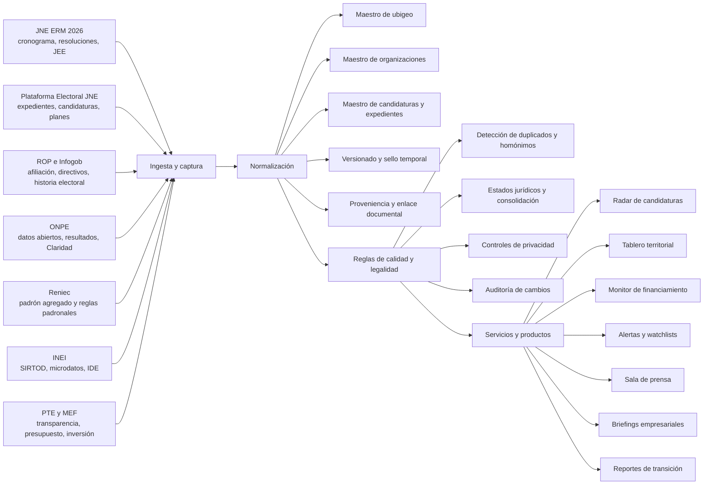
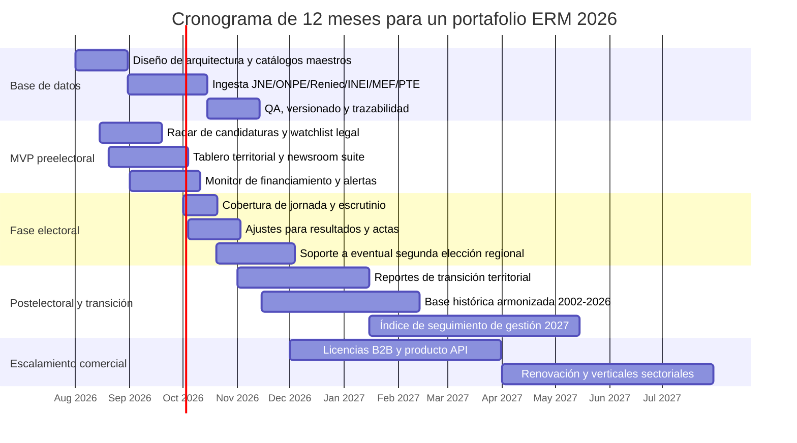

# Oportunidades de productos digitales, contenidos y servicios de análisis para las Elecciones Regionales y Municipales del Perú 2026

## Resumen ejecutivo

Las Elecciones Regionales y Municipales del Perú 2026 ya entraron en una fase en la que existen suficientes activos públicos para construir productos útiles de alto valor: el JNE mantiene un micrositio específico de ERM 2026 con cronograma, resoluciones, JEE y normativa; ya está operativa la Plataforma Electoral para expedientes, candidaturas y planes; existe un reporte público de inscripción de listas con actualización visible; la ONPE habilita datos abiertos y portales de resultados/financiamiento; y el Reniec ya cerró el padrón para este proceso y ha difundido cifras oficiales agregadas del electorado. A ello se suma una base territorial robusta en INEI y fuentes administrativas complementarias en transparencia y presupuesto. En otras palabras: no hay un vacío de datos, sino un problema de integración, estandarización, lectura jurídica y velocidad de uso. citeturn25search2turn15search2turn25search1turn11view0turn16search5turn16search15turn17search1turn18search0turn30search4

La ventana comercial y cívica más valiosa está concentrada entre ahora y la jornada electoral del 4 de octubre de 2026: seguimiento de listas y candidaturas, monitoreo de expedientes, alertas de tachas/exclusiones, comparación de planes, perfiles territoriales, monitoreo de financiamiento, productos para salas de prensa y servicios de inteligencia pública para empresas y gestores públicos. Una segunda ventana se abre entre el cierre electoral, la publicación consolidada de resultados y la etapa de transición; además, en la elección regional existe la posibilidad de una segunda elección si ninguna fórmula supera el 30 % de los votos válidos, lo que vuelve especialmente valiosos los productos reusables para escenarios, alertas y seguimiento post primera vuelta. citeturn26search11turn29search3turn29search13turn32search2

La mejor oportunidad no es un “portal informativo” genérico, sino una **capa de datos unificada** con identificación territorial por ubigeo, normalización de organizaciones políticas y trazabilidad de expedientes, encima de la cual se pueden empaquetar al menos cuatro líneas de negocio: suscripciones B2B para medios y empresas, analítica/compliance para organizaciones políticas, reportes de transición y gestión para autoridades/gestores públicos, y productos cívicos o patrocinados para ciudadanía. La factibilidad técnica es alta cuando se parte de fuentes oficiales ya digitales —JNE, ONPE, Reniec, INEI, transparencia y MEF— y baja cuando se intenta depender de información dispersa en portales subnacionales no homologados. citeturn22view0turn12search0turn11view0turn17search17turn18search0turn30search0

Mi conclusión es que el portafolio con mejor relación entre utilidad, diferenciación y factibilidad está encabezado por veinte productos, pero los **cinco con mejor retorno esperado inmediato** son: un radar de candidaturas y expedientes, un tablero territorial de contexto electoral, un monitor de financiamiento y franja, un sistema de alertas de cambios regulatorios/electorales por territorio y una sala de prensa ERM 2026 lista para redacciones y equipos de campaña. Estas cinco líneas aprovechan activos oficiales existentes, pueden desarrollarse en plazos cortos y responden a preguntas concretas de casi todos los públicos objetivo. citeturn15search1turn15search2turn19search1turn22view0turn34search1

## Contexto electoral y demanda por público

A julio de 2026, el proceso ya tiene hitos suficientemente definidos para activar productos y servicios con uso inmediato: el proceso electoral regional y municipal se realizará el 4 de octubre de 2026; el padrón para este proceso se cerró el 7 de abril de 2026; Reniec reportó 26,314,724 electores para las ERM a nivel nacional; el JNE ya publica el seguimiento de inscripción de fórmulas y listas; y la ONPE ya sorteó más de ochocientos mil miembros de mesa. Eso convierte a las próximas semanas en una etapa dominada por verificación legal de candidaturas, segmentación territorial, periodismo de fiscalización, preparación operativa y lectura de riesgos locales. citeturn26search11turn16search5turn16search15turn25search1turn33search0

La complejidad territorial también es estructural. El INEI trabaja con 196 provincias y 1,874 distritos en sus sistemas territoriales, mientras que el JNE definió 91 circunscripciones administrativas y de justicia electoral para las ERM 2026. Eso significa que cualquier producto serio necesita una capa de homologación territorial que conecte ubigeo, circunscripción electoral, entidad pública, organización política y expediente. Sin esa capa, los productos terminan en visualización fragmentada o en errores de atribución. citeturn17search11turn25search4

### Preguntas priorizadas por público objetivo

| Público objetivo | Preguntas concretas priorizadas |
|---|---|
| Ciudadanos | ¿Quiénes postulan en mi región, provincia o distrito? ¿Qué estado legal tiene cada lista? ¿Qué propone cada candidatura en su plan de gobierno/trabajo? ¿Quiénes financian la campaña? ¿Qué ha pasado históricamente en mi territorio y qué tan competitiva es esta elección? |
| Periodistas | ¿Qué candidaturas cambiaron de estado hoy? ¿Qué listas están inadmisibles, improcedentes o en tacha? ¿Qué trayectorias tienen los candidatos y organizaciones? ¿Qué redes partidarias o afiliativas existen detrás? ¿Qué gasto o financiamiento ya es visible? ¿Qué historias territoriales se explican con datos demográficos, pobreza, crimen, presupuesto o inversión? |
| Candidatos | ¿Quién compite realmente en cada circunscripción? ¿Dónde hay fortalezas y debilidades territoriales propias y rivales? ¿Qué riesgos regulatorios o de expediente existen? ¿Cómo comparan mi plan y mi lista frente a la competencia? ¿Qué alertas reputacionales o de financiamiento debo atender? |
| Organizaciones políticas | ¿Cómo monitoreo cumplimiento de listas, cuotas, afiliaciones, expedientes y finanzas? ¿Dónde tengo estructura orgánica y dónde no? ¿Qué candidatos requieren seguimiento legal intensivo? ¿Qué plazas son competitivas o recuperables? ¿Qué riesgos de sanción o de demoras existen en reportes financieros? |
| Empresas | ¿Qué autoridades regionales o municipales probablemente cambiarán mi entorno regulatorio o de permisos? ¿Dónde hay mayor riesgo político, conflictividad o volatilidad? ¿Qué territorios combinan alta competencia electoral con alta inversión pública o exposición sectorial? ¿Qué candidatos o movimientos tienen peso local relevante? |
| Gestores públicos | ¿Qué compromisos programáticos de electos podrían impactar presupuesto, servicios o estructura municipal/regional? ¿Dónde conviene anticipar la transición? ¿Qué brechas territoriales muestran mayor presión política? ¿Qué comparables existen entre gestión saliente, oferta electoral y margen fiscal? |

Estas preguntas son coherentes con la oferta oficial hoy disponible: el JNE ya publica candidaturas, expedientes, estados y planes; el ROP expone afiliación, padrones, directivos, estatutos y resoluciones; Infogob centraliza historia electoral, partidos, localidades y políticos; Claridad concentra información financiera partidaria y de campaña; Reniec concentra la base electoral y sus procedimientos; e INEI ofrece el contexto territorial y sociodemográfico. citeturn15search2turn15search5turn15search19turn22view0turn12search0turn21view0turn16search14turn17search1turn17search14

## Fuentes oficiales y bases de datos disponibles

La infraestructura pública relevante para ERM 2026 está fragmentada, pero es explotable. El núcleo duro es JNE–ONPE–Reniec; el contexto territorial y socioeconómico lo aporta INEI; y, para productos orientados a empresas y gestores públicos, conviene sumar Transparencia Estándar y MEF. La clave metodológica es diferenciar entre **fuentes registrales/jurídicas**, **fuentes de resultados**, **fuentes de financiamiento**, **fuentes padronales agregadas** y **fuentes de contexto territorial**. citeturn25search2turn11view0turn16search5turn17search1turn18search0turn30search4

### Tabla comparativa de fuentes y bases de datos

| Fuente o base | Institución | Campos clave útiles | URL oficial | Tipo de acceso | Formato | Frecuencia de actualización | Calidad y cobertura | Riesgos metodológicos principales |
|---|---|---|---|---|---|---|---|---|
| Micrositio ERM 2026 | JNE | Cronograma electoral, convocatoria, acuerdos y resoluciones, JEE, reglamentos, primarias, reportes analíticos | Sitio ERM 2026 citeturn25search2 | Consulta web | HTML; vínculos a PDF | Eventual, según hito normativo | Alta calidad normativa; cobertura oficial del proceso | No es dataset limpio; exige extracción manual/semiautomática |
| Plataforma Electoral | JNE | Expediente, candidatos, estados de lista, hojas de vida, planes de gobierno/trabajo, búsqueda avanzada | Plataforma Electoral citeturn15search2turn15search11turn15search19turn15search16 | Consulta web | HTML; documentos asociados | Alta, durante inscripción y justicia electoral | Muy alta utilidad operativa | Cambios rápidos de estado; posible carga dinámica; no API pública especificada |
| Reporte de inscripción de listas ERM 2026 | JNE | Estado agregado de inscripción por fórmula/lista/circunscripción | Reporte ERM 2026 citeturn25search1 | Consulta web embebida | Power BI/HTML | Visible con sello de última actualización | Alta utilidad ejecutiva para seguimiento | Agregado; no sustituye el expediente jurídico detallado |
| Registro de Organizaciones Políticas | JNE | Consulta de afiliación, padrones de afiliados, directivos, estatutos, reglamentos electorales, actas de fundación, resoluciones, síntesis en trámite | SROP público citeturn22view0turn22view2turn22view3 | Consulta web | HTML; PDFs/documentos | Continua o periódica según trámite | Fuente oficial registral, muy valiosa para estructura partidaria | Sensibilidad de datos personales; no equivale a viabilidad electoral de una candidatura |
| Infogob | JNE | Políticos, partidos, elecciones, resultados electorales desde 1931, localidades, análisis | Infogob citeturn12search0turn7search16 | Consulta web | HTML | Permanente; enfoque histórico | Cobertura histórica muy amplia | Puede requerir normalización adicional para series comparables |
| Reportes analíticos EG 2026 y ERM 2026 | JNE | Reportes temáticos, análisis territoriales y coyunturales del proceso | Reportes analíticos citeturn34search1turn34search12 | Consulta web / descarga | HTML y PDF | Eventual, por publicación | Alta calidad interpretativa oficial | No siempre estructurados para análisis automatizado |
| Datos abiertos ONPE | ONPE | Conjuntos descargables para investigación, negocio, control ciudadano; el formato más usado es CSV | Datos abiertos ONPE citeturn11view0turn8view0 | Descarga | CSV; API no especificada en la fuente visible | Según conjunto publicado | Alta factibilidad para ETL | El catálogo visible no detalla en la página abierta todos los esquemas de cada dataset |
| Resultados históricos ONPE | ONPE | Organización política, total, % votos válidos, resultados por ámbito geográfico; en historiales de procesos específicos | Resultados históricos ONPE citeturn3search10turn32search7turn3search0turn3search2 | Consulta web | HTML | Cerrado una vez consolidado cada proceso | Muy alta autoridad sobre resultados | Estructuras distintas por proceso; limpieza histórica necesaria |
| Resultados en tiempo real / publicación de actas | ONPE | Actas, votos, avance de procesamiento, difusión pública | Resultados en tiempo real y aclaración técnica citeturn7search7turn32search2 | Consulta web | HTML/API interna no documentada públicamente | Muy alta en jornada y escrutinio | Muy alta cobertura operativa | Latencias entre votos, actas digitalizadas e indexación; riesgo de lecturas erróneas tempranas |
| Claridad | ONPE | Información financiera anual, contabilidad partidaria, información financiera de campaña, normas, consultas públicas | Claridad y campaña electoral citeturn1search13turn21view0turn19search1 | Consulta web | HTML; PDFs | Periódica según obligación legal | Fuente oficial central para finanzas partidarias | No es estrictamente “tiempo real”; los reportes tienen rezagos formales |
| Reglas y plazos de financiamiento | ONPE | Primer y segundo reporte de campaña, franja electoral, sanciones, obligaciones, topes/criterios | Normas sobre finanzas partidarias citeturn19search2 | Descarga | PDF | Cuando cambia normativa o se publica guía | Alta calidad jurídica-operativa | Lectura legal exige interpretación; no reemplaza reportes de movimiento efectivo día a día |
| Padrón y noticias ERM 2026 | Reniec | Fecha de cierre del padrón, electores por región y total nacional, grupos de edad, grado de instrucción, estado civil, actos administrativos por proceso | Reniec ERM 2026 citeturn16search5turn16search15turn26search11turn16search18turn26search20 | Consulta web | HTML; actos y resoluciones en PDF | Por hitos del proceso | Fuente oficial base del universo electoral | El padrón individual no es una base abierta para explotación comercial irrestricta |
| FAQ y Dirección de Registro Electoral | Reniec | Impugnación de domicilio, plazos, competencias, gestión georreferenciada del registro electoral | FAQ y Dirección de Registro Electoral citeturn16search14turn26search13 | Consulta web | HTML | Eventual | Buena para compliance y procedimientos | Insumo normativo/procedimental, no base analítica masiva |
| SIRTOD | INEI | Indicadores regionales, provinciales y distritales; variables demográficas, sociales, económicas, municipales y de presupuesto por resultados | SIRTOD citeturn17search1turn17search4turn17search9 | Consulta web | HTML; reportes/descargas no siempre homólogos | Continua según indicador | Muy útil para contexto territorial | Series heterogéneas y no siempre sincronizadas temporalmente con el proceso electoral |
| Microdatos INEI | INEI | Bases y documentación metodológica de encuestas e investigaciones; resguardo del secreto estadístico | Microdatos INEI citeturn17search14turn17search6 | Descarga | CSV, SPSS, STATA y otros | Según operación estadística | Alta calidad metodológica | Riesgo de desfase temporal; no siempre a escala distrital |
| Infraestructura de Datos Espaciales | INEI | WMS, WFS, catálogo de metadatos, capas cartográficas, geodatos | IDE INEI citeturn17search17 | Servicios geoespaciales / descarga | WMS, WFS, capas | Variable | Muy útil para mapas y joins espaciales | Requiere capacidades GIS y control de versiones |
| Portal de Transparencia Estándar | PCM / entidades | Directorio, normas, instrumentos de gestión, presupuesto, declaraciones juradas, ordenanzas y resoluciones regionales/municipales | PTE y ejemplos subnacionales citeturn18search0turn18search3turn18search1turn18search2 | Consulta web | HTML y PDF | Variable por entidad | Cobertura amplia y oficial | Heterogeneidad en completitud, nomenclatura y oportunidad |
| Presupuesto y ejecución | MEF | PIA, PIM, ejecución de ingreso/gasto, diario/mensual/trimestral, inversión, transferencias | Consulta Amigable y portal económico citeturn30search0turn30search4turn30search20turn30search5 | Consulta web | HTML | Muy alta para ejecución | Muy valioso para productos de transición y gestión | No es fuente electoral; requiere cruce contextual |
| Datos abiertos del MEF | MEF | Gasto del GN, gobiernos regionales y locales, 2012-2025 en CSV | Datos abiertos MEF citeturn30search16 | Descarga | CSV | Según publicación del portal | Útil para series históricas | Puede ir rezagado frente a módulos vivos de consulta |

### Lectura práctica de las fuentes

Para construir productos robustos, conviene tratar a cada fuente según su función real. **JNE** sirve para la capa jurídica y registral; **ONPE** para resultados, operación y financiamiento; **Reniec** para el universo electoral y reglas padronales; **INEI** para contexto y segmentación territorial; y **PTE/MEF** para traducir oferta política en capacidad de gestión y restricciones presupuestarias. citeturn25search2turn11view0turn16search5turn17search1turn18search0turn30search4

El principal problema metodológico no es la ausencia de información, sino su **desfase temporal** y su **heterogeneidad estructural**. ONPE reconoce que la publicación pública puede mostrar latencias entre votos, actas digitalizadas e indexación; Claridad opera sobre entregas formales con cortes legales; el ROP y la Plataforma Electoral muestran estados que evolucionan; y el INEI mezcla indicadores con distintas ventanas temporales. Por eso, cualquier producto serio debe etiquetar todo dato con `fuente`, `fecha de captura`, `fecha de actualización oficial`, `nivel territorial`, `estado jurídico` y `grado de consolidación`. citeturn32search2turn19search2turn15search5turn22view0turn17search14

## Portafolio priorizado de veinte productos

El siguiente portafolio está ordenado de mayor a menor prioridad analítica combinando tres criterios: **utilidad** para resolver preguntas de mercado o de servicio público, **diferenciación** frente a un portal informativo básico y **factibilidad** basada en fuentes públicas ya disponibles. La escala usada es de 1 a 5. Los tiempos y recursos son **estimaciones analíticas**, porque el presupuesto disponible y el tamaño del equipo son **no especificados**.

### Tabla comparativa de productos, contenidos y servicios

| Nombre | Utilidad | Diferenciación | Factibilidad | Descripción | Público objetivo | Datos necesarios | Fuentes prioritarias | Modelo de negocio o monetización | Recursos técnicos estimados | Tiempo estimado mínimo | Principales riesgos |
|---|---:|---:|---:|---|---|---|---|---|---|---|---|
| Radar de candidaturas y expedientes ERM 2026 | 5 | 4 | 5 | Seguimiento diario de listas, estados, cambios, resoluciones y alertas por territorio/organización | Periodistas, organizaciones políticas, candidatos, ciudadanos avanzados | Expedientes, estados, candidatos, resoluciones, ubigeo, listas | Plataforma Electoral, Reporte de Inscripción, micrositio ERM 2026 citeturn15search2turn25search1turn25search2 | Suscripción B2B; acceso freemium cívico | 1 data engineer, 1 full-stack, 1 analista electoral | 3 a 5 semanas | Cambios frecuentes de estado; scraping frágil; ambigüedad nominal |
| Tablero territorial ERM 2026 | 5 | 5 | 4 | Dashboard por región/provincia/distrito con historia electoral, electorado, demografía, pobreza, seguridad y presupuesto | Ciudadanos, periodistas, empresas, gestores públicos | Ubigeo, resultados históricos, padrón agregado, indicadores INEI, gasto/inversión | Infogob, ONPE histórico, Reniec, SIRTOD, MEF citeturn12search0turn3search10turn16search15turn17search1turn30search4 | Licencias institucionales; reportes premium | 1 data engineer, 1 BI dev, 1 GIS/analista | 4 a 8 semanas | Series heterogéneas; necesidad de homologación territorial |
| Monitor de financiamiento y franja electoral | 5 | 5 | 4 | Seguimiento de ingresos, gastos, obligaciones, franja y sanciones con trazabilidad legal | Periodistas, organizaciones políticas, candidatos, observadores | Información financiera anual/campaña, normas, cronología de entregas | Claridad y guía financiera ONPE citeturn21view0turn19search2 | Suscripción premium; compliance service | 1 data engineer, 1 analista legal-financiero, 1 frontend | 4 a 6 semanas | Rezago legal de reportes; lectura errónea como “tiempo real” |
| Watchlist de tachas, exclusiones, inadmisibilidades e improcedencias | 5 | 4 | 5 | Alertas enfocadas en riesgo jurídico-electoral por candidatura y lista | Periodistas, partidos, candidatos, abogados | Estados legales, resoluciones, causales, notificaciones, plazos | Plataforma Electoral y resoluciones del JNE/JEE citeturn15search5turn25search4 | Suscripción profesional | 1 full-stack, 1 analista electoral-jurídico | 2 a 4 semanas | Requiere interpretación jurídica cuidadosa; alto costo humano de validación |
| Sala de prensa ERM 2026 para redacciones | 5 | 4 | 5 | Producto editorial con dashboards, alertas y fichas listas para publicación | Periodistas y medios | Lo anterior + comparadores, fichas, visualizaciones | JNE, ONPE, Reniec, INEI, MEF citeturn15search2turn11view0turn16search15turn17search1turn30search4 | Contratos con medios; white-label | 1 editor de datos, 1 diseñ. info, 1 desarrollador, 1 analista | 3 a 6 semanas | Dependencia de ciclos noticiosos y soporte editorial intenso |
| Sistema de alertas por territorio, persona u organización | 5 | 4 | 4 | Notificaciones automáticas cuando cambia un expediente, una lista, una norma o un reporte | Periodistas, candidatos, OP, empresas | Cambios capturados en fuentes, snapshots, reglas de matching | JNE, ROP, Claridad, ONPE, PTE citeturn15search2turn22view0turn21view0turn18search0 | SaaS por usuario/equipo | 1 backend, 1 full-stack, 1 data engineer | 4 a 6 semanas | Falsos positivos por homónimos y cambios de nomenclatura |
| API o capa maestra de datos electorales subnacionales | 5 | 5 | 3 | Backbone de datos normalizados para consumo interno o de terceros | Medios, consultoras, universidades, partidos, empresas | Catálogos de ubigeo, OP, candidatos, expedientes, resultados, indicadores | JNE, ONPE, Reniec, INEI, MEF citeturn12search0turn11view0turn16search15turn17search17turn30search16 | Licenciamiento/API privada | 2 data engineers, 1 arquitecto, 1 QA | 8 a 12 semanas | Mantenimiento continuo; gobernanza de IDs; versionado |
| Due diligence de candidatos y organizaciones | 5 | 5 | 4 | Fichas investigativas que combinan trayectoria política, afiliación, cargo, territorio y señales de riesgo | Empresas, medios, campañas, observadores | Historial político, afiliación, directivos, expedientes, financiamiento, contexto local | Infogob, SROP, Plataforma Electoral, Claridad, PTE citeturn12search0turn22view0turn15search2turn21view0turn18search0 | Servicio profesional por encargo | 1 analista senior, 1 periodista de datos, 1 support data | 1 a 3 semanas por paquete inicial | Riesgo reputacional; homónimos; privacidad y difamación si se interpreta mal |
| Comparador de planes de gobierno/trabajo vs brechas | 5 | 5 | 3 | Cruza propuestas con indicadores territoriales y presupuesto/inversión | Ciudadanos, medios, gestores públicos, empresas | Planes, indicadores territoriales, PIA/PIM, inversión, series históricas | Plataforma Electoral, INEI, MEF, PTE citeturn15search19turn17search1turn30search4turn18search0 | Suscripción institucional; informes temáticos | 1 NLP/data analyst, 1 full-stack, 1 policy analyst | 6 a 10 semanas | Texto heterogéneo y poco estructurado; riesgo de sobre-interpretación |
| Escenarios de competitividad y segunda elección regional | 4 | 5 | 4 | Simulaciones territoriales y mapas de contienda para gobiernos regionales y plazas críticas | Medios, campañas, analistas, empresas | Historial regional, inscripción actual, electorado, dispersión territorial | ONPE histórico, Infogob, JNE ERM 2026, Reniec citeturn3search10turn12search0turn25search2turn16search15turn29search3 | Suscripción premium; briefings | 1 científico de datos, 1 analista electoral | 4 a 8 semanas | Riesgo de presentarlo como predicción; incentivos al sobreajuste |
| Mapa de afiliaciones, directivos y estructura partidaria | 4 | 4 | 5 | Visualiza presencia organizativa formal y cuadros vigentes por organización | Partidos, periodistas, empresas | Padrones, directivos, estatutos, resoluciones, afiliación | SROP/ROP citeturn22view0turn22view2turn22view3 | Suscripción para OP y medios | 1 data engineer, 1 frontend | 3 a 5 semanas | Protección de datos; diferencias entre estructura formal y real |
| Perfil agregado del electorado por territorio | 4 | 4 | 4 | Combina electores agregados con edad, instrucción y contexto socioeconómico | Campañas, medios, empresas, gestores públicos | Electores agregados, edad, instrucción, estado civil, demografía, pobreza | Reniec, INEI, SIRTOD citeturn16search18turn16search15turn17search1 | Reportes temáticos; SaaS segmentado | 1 data analyst, 1 BI dev | 3 a 6 semanas | Riesgo de inferencias abusivas; prohibido operar a nivel personal |
| Benchmark de organizaciones políticas y movimientos regionales | 4 | 4 | 4 | Ranking comparativo por presencia territorial, historial, estructura y desempeño | Periodistas, partidos, empresas | Inscripción, padrones, directivos, resultados, cobertura territorial | ROP, Infogob, ONPE histórico citeturn22view0turn12search0turn3search10 | Suscripción; informes ejecutivos | 1 analista estratégico, 1 data analyst | 3 a 6 semanas | Comparabilidad imperfecta entre partidos nacionales y movimientos regionales |
| Mapa de conflictos y riesgo operativo electoral | 4 | 5 | 3 | Cruza alertas electorales, seguridad, emergencias y condiciones territoriales | Empresas, Jefaturas de campaña, medios, observadores | Alertas electorales, criminalidad, emergencias, logística territorial | MACE ONPE, DATACRIM INEI, JNE, INDECI citeturn5view0turn17search2turn34search3turn34search7 | Servicio premium; monitoreo mensual | 1 GIS analyst, 1 data engineer, 1 analista político | 6 a 8 semanas | Coberturas desiguales y señal/ruido alta |
| Monitor de desinformación y verificación local | 4 | 5 | 3 | Sistema para detectar, clasificar y responder a rumores electorales por territorio | Medios, observatorios, campañas, ciudadanía | Alertas, desmentidos oficiales, redes, repositorio de claims | ONPEChequea y JNE Fact Checking/alertas citeturn32search4turn34search13turn34search0 | Contratos con medios/ONG; patrocinio | 1 analista de OSINT, 1 editor, 1 data engineer | 6 a 8 semanas | Alto componente manual; riesgo de amplificar narrativas falsas |
| Briefings ejecutivos para empresas expuestas a gobiernos subnacionales | 4 | 5 | 4 | Informes por territorio sobre cambio político probable, inversión pública y gobernanza local | Empresas, gremios, fondos, infraestructura | Candidaturas, historial, presupuesto, inversión, transparencia, riesgo territorial | JNE, MEF, PTE, INEI citeturn15search2turn30search4turn18search0turn17search1 | Servicio premium por plaza/sector | 1 consultor senior, 1 analista de datos | 1 a 2 semanas por territorio inicial | Riesgo de causalidad espuria entre elección y regulación |
| Reportes de transición para gestores públicos | 4 | 4 | 4 | Carpeta por territorio con brechas, presión política, promesas, presupuesto y proyectos | Gestores públicos, autoridades electas, cooperación | Planes, brechas, ejecución, inversión, historial de gestión | Plataforma Electoral, INEI, MEF, PTE citeturn15search19turn17search1turn30search5turn18search0 | Servicio institucional; cooperación técnica | 1 policy analyst, 1 data analyst | 3 a 6 semanas | Riesgo de politización; necesidad de neutralidad estricta |
| Base histórica armonizada ERM 2002-2026 | 4 | 4 | 3 | Serie histórica limpia y comparable de resultados subnacionales y contexto | Medios, academia, consultoras, partidos | Resultados históricos, localidades, series INEI, cambios territoriales | ONPE histórico, Infogob, INEI citeturn3search10turn12search0turn17search1 | Licencia de datos; academia/proyectos | 2 data engineers, 1 historiador de datos | 8 a 12 semanas | Redistritaje, cambios de nomenclatura y consistencia de series |
| Kit cívico hiperlocal de contenido basado en datos | 4 | 3 | 5 | Explicadores, comparadores y visuales para ciudadanos por territorio | Ciudadanos, ONG, educación cívica, medios locales | Candidaturas, planes, fechas, procedimientos, contexto básico | JNE, ONPE, Reniec, INEI citeturn25search2turn33search0turn26search11turn17search1 | Patrocinio, grant, branded civic content | 1 editor, 1 diseñador, 1 analista | 2 a 4 semanas | Escala editorial; debe evitar tono persuasivo |
| Índice de seguimiento pos-electoral 2027 | 4 | 5 | 3 | Mide promesas versus presupuesto, inversiones y primeras decisiones de gestión | Gestores públicos, medios, empresas, ciudadanía | Planes de gobierno, PIA/PIM, ejecución, normas locales, inversión | Plataforma Electoral, MEF, PTE, INEI citeturn15search19turn30search4turn18search3turn17search1 | Suscripción anual; observatorio | 1 policy lead, 1 data engineer, 1 analista fiscal | 10 a 16 semanas | Dificultad de traducir propuestas políticas en métricas observables |
| Servicio de compliance electoral para campañas y partidos | 4 | 4 | 4 | Acompañamiento en obligaciones de expediente, finanzas y registros | Candidatos, partidos, movimientos regionales | Reglas, plazos, estados, finanzas, afiliación | JNE, Claridad, ROP, Reniec FAQ citeturn25search2turn19search2turn22view0turn16search14 | Consultoría B2B | 1 abogado electoral, 1 analista, 1 soporte de datos | 1 a 3 semanas de implementación | Riesgo legal y reputacional; requiere protocolos éticos estrictos |

### Qué conviene lanzar primero

Si el objetivo es entrar al mercado antes del 4 de octubre con una base sólida, yo priorizaría tres capas. La primera es una **capa maestra de datos** de JNE–ONPE–Reniec–INEI–MEF; la segunda, un **MVP de radar legal y territorial**; y la tercera, un **producto empaquetado** distinto por público: newsroom suite para periodistas, watchlist/compliance para organizaciones políticas, y briefings/regulatory watch para empresas y gestores públicos. Esa secuencia reduce dependencia de productos “bonitos” pero frágiles y maximiza la reutilización de la inversión técnica. citeturn15search2turn11view0turn16search15turn17search1turn30search4

## Arquitectura de datos y cronograma

La arquitectura recomendada debe partir de una premisa: la unidad de integración no es la “noticia” ni el “PDF”, sino el **objeto electoral**. En ERM 2026 los objetos críticos son: territorio, organización política, candidatura, expediente, lista/fórmula, acto jurídico, reporte financiero, resultado y fuente documental. Esa estructura permite agregar productos distintos sin rehacer cada vez el ETL. citeturn15search2turn22view0turn12search0turn21view0

La ventaja de este diseño es que desacopla la recolección del empaquetamiento comercial. Una vez creada la capa maestra, el mismo pipeline sirve para productos cívicos, monitoreo periodístico, servicios de due diligence y observación pos-electoral. Además, permite etiquetar con claridad los datos que son **oficiales consolidados**, los que están **en proceso** y los que son **inferencias analíticas**, algo indispensable cuando existen latencias o cambios de estado. citeturn32search2turn25search1turn15search5

### Timeline mínimo de doce meses

El cronograma más razonable, partiendo de finales de julio de 2026, es de doce meses con un pico preelectoral inmediato, una fase crítica de jornada y escrutinio, y una prolongación hacia transición y seguimiento de gestión. La posible segunda elección regional —si se activa por no alcanzar el umbral de 30 % de votos válidos— justifica que la arquitectura y el soporte no se apaguen el 4 de octubre. citeturn26search11turn29search3turn29search13

## Limitaciones, riesgos y recomendaciones prácticas

La primera limitación es de **temporalidad**. No toda la información crítica estará disponible con la misma velocidad. ONPE ya ha advertido, en el contexto de publicación de resultados, que puede haber latencias entre procesamiento, validación, consolidación, indexación y publicación pública de actas; Claridad opera con entregas formales de información financiera y no con observación minuto a minuto; y los estados de listas/candidaturas en el JNE cambian conforme avanzan la calificación, subsanación, tachas y resoluciones. Un producto serio debe mostrar al usuario cuándo un dato es preliminar, cuándo es consolidado y cuándo es solamente una alerta. citeturn32search2turn19search2turn15search5turn25search1

La segunda limitación es de **integridad estructural**. Los nombres de candidaturas y organizaciones pueden venir con variantes; los territorios requieren homologación estricta por ubigeo; y los portales descentralizados de transparencia no siempre son uniformes en formatos o metadatos. El riesgo más común aquí es construir un dashboard visualmente atractivo pero metodológicamente incongruente. La mitigación práctica es mantener catálogos maestros, bitácora de cambios y auditoría de joins territoriales antes de publicar cualquier ranking o alerta. citeturn17search17turn18search0turn18search3turn30search5

La tercera limitación es **legal y de privacidad**. La Ley N.° 29733 protege el tratamiento de datos personales, y el nuevo reglamento de protección de datos personales está vigente desde el 31 de marzo de 2025. Además, el propio INEI recuerda que sus microdatos se difunden resguardando el secreto estadístico. Esto obliga a evitar productos basados en explotación individualizada del padrón o en perfiles personales no autorizados. El estándar recomendable es trabajar con información pública oficial estrictamente necesaria, minimizar datos identificables, registrar base legal y aplicar controles de acceso por tipo de cliente. citeturn35search1turn35search10turn17search14

La cuarta limitación es de **sesgo de observación**. Los datos oficiales no son neutrales por el mero hecho de ser oficiales: un reporte financiero puede estar incompleto por rezago; un plan de gobierno puede ser formal y muy poco comparable con otro; un padrón agregado puede sobre-representar categorías útiles para campaña pero no necesariamente explicar comportamiento electoral; y un portal de transparencia refleja cumplimiento documental, no capacidad política real. La recomendación es distinguir siempre entre **dato administrativo**, **dato analítico** e **inferencia**. citeturn19search2turn15search19turn16search18turn18search0

### Recomendaciones de implementación

Primero, conviene lanzar un **MVP de cuatro módulos**: radar legal, tablero territorial, alertas y una capa mínima de finanzas de campaña. Esa combinación aprovecha la mayor cantidad de fuentes oficiales hoy activas y resuelve preguntas muy concretas de periodistas, partidos y empresas. citeturn15search2turn25search1turn21view0turn16search15

Segundo, toda publicación debería llevar cuatro etiquetas visibles: **fuente oficial**, **fecha de actualización oficial**, **fecha de captura del producto** y **estado de consolidación**. Esa simple disciplina reduce errores de interpretación y protege reputacionalmente al producto ante cambios rápidos o desinformación. citeturn32search2turn32search4

Tercero, hay que separar el uso **cívico/editorial** del uso **comercial/compliance**. No todos los clientes necesitan la misma granularidad ni el mismo nivel de sensibilidad. Para ciudadanía y periodismo basta una capa agregada y explicativa; para empresas y organizaciones políticas se requiere mayor trazabilidad documental y control de acceso. Esa separación también ayuda a cumplir mejor con la protección de datos personales y a reducir exposición legal. citeturn35search1turn35search10

Cuarto, la integración con presupuesto, inversión y transparencia no debe verse como “extra”, sino como el principal factor de diferenciación. Muchos productos electorales se quedan en quién compite; pocos conectan esa competencia con la **capacidad real de gobernar**, el portafolio de inversión, las reglas locales y las restricciones fiscales. Para empresas y gestores públicos, esa conexión es probablemente el elemento más monetizable. citeturn30search4turn30search5turn18search0

Quinto, el equipo base debería incluir no solo perfiles técnicos, sino al menos una persona con criterio **electoral-jurídico** y otra con criterio **territorial o de política pública**. En ERM 2026 el error típico no será de código, sino de interpretación: leer un estado de lista como definitivo cuando no lo es, comparar propuestas sin normalizarlas o usar datos personales más allá de lo permitido. Las fuentes públicas son ricas; convertirlas en producto confiable exige mediación experta. citeturn15search5turn25search4turn35search1